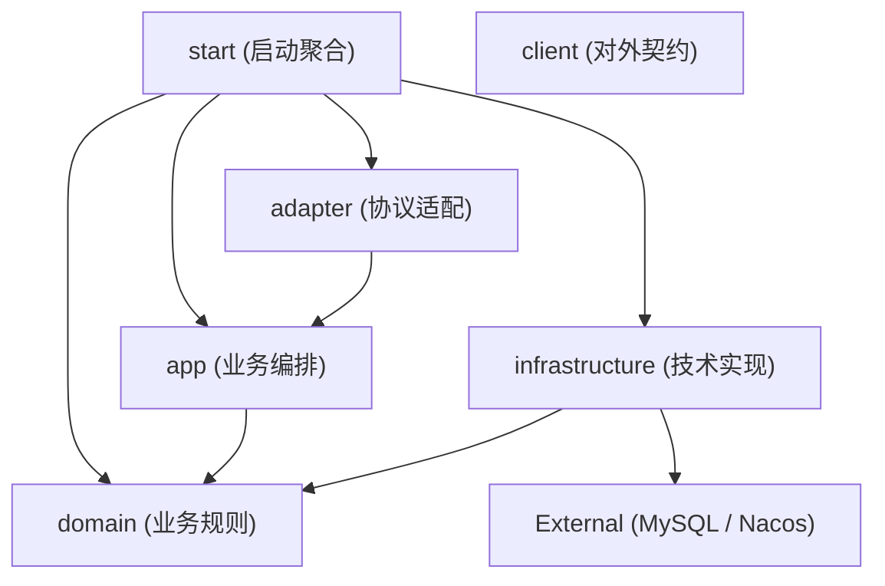

# ARCHITECTURE.md

<!--!
  长期稳定架构约束——系统边界、分层、核心依赖方向。
  修改本文件应走独立的架构 RFC（docs/design-docs/arch-*.md）。
  智能体在开始任何编码任务前应先阅读此文件。
-->

## 系统概述

valhalla-user 是 Valhalla 平台的用户管理微服务，为平台管理后台和其他内部微服务提供用户身份、RBAC 权限体系（角色/权限/接口三级模型）的完整管理能力。

服务采用 COLA 5.0 DDD 分层架构，基于 mimir-boot 2.1.0（Spring Boot 3.3 封装）构建。对外暴露 RESTful API（HTTP 8081）供管理后台调用，未来通过 Dubbo RPC（20880）供其他微服务消费。数据层使用 MySQL 8.4 + MyBatis-Plus，配置中心使用 Nacos，通过 Docker 容器化部署。

密码认证由独立的 valhalla-auth 服务管理，本服务不存储密码。

## 项目结构

```
project-root/
├── valhalla-user-start/          # 启动层：Spring Boot 主类、配置文件、Starter 依赖聚合
│   └── src/main/
│       ├── java/.../start/       # Application.java（scanBasePackages: com.yggdrasil.labs, com.alibaba.cola）
│       └── resources/            # application.yml + profile 配置（dev/test/prod 都走 Nacos）
├── valhalla-user-adapter/        # 适配层：协议适配（HTTP/RPC），请求转换
│   └── src/main/java/.../adapter/
│       ├── web/controller/       # REST 控制器（User/Role/Permission/Api）
│       ├── web/request/          # HTTP 请求体 VO
│       ├── web/convert/          # Request ↔ Cmd/Query 转换器（MapStruct）
│       ├── wap/                  # WAP 协议适配（预留）
│       └── mobile/               # Mobile 协议适配（预留）
├── valhalla-user-client/         # 契约层：对外发布的 DTO、Client 接口、枚举
│   └── src/main/java/.../client/
│       ├── api/                  # Client 接口定义（UserClient/RoleClient/PermissionClient/ApiClient）
│       ├── dto/{domain}/co/      # Client Object（返回给调用方的数据结构）
│       ├── dto/{domain}/cmd/     # Command DTO（写操作入参）
│       ├── dto/{domain}/query/   # Query DTO（读操作入参）
│       └── dto/enums/            # 公共枚举（ErrorCode, UserSourceEnum, ApiStatusEnum 等）
├── valhalla-user-app/            # 应用层：业务编排、CQRS 命令/查询执行器
│   └── src/main/java/.../app/
│       ├── {domain}/executor/    # 命令执行器（Create/Update/Delete/AssignXxxCmdExe）
│       ├── {domain}/query/       # 查询执行器（GetXxxQueryExe, PageXxxQueryExe）
│       ├── {domain}/assembler/   # 领域对象 ↔ CO 转换（MapStruct）
│       ├── {domain}/dto/         # 应用层内部 DTO（cmd/query/co）
│       ├── service/              # 应用服务接口定义
│       ├── service/impl/         # 应用服务实现（编排 executor）
│       └── common/dto/enums/     # 应用层公共枚举
├── valhalla-user-domain/         # 领域层：核心业务规则、实体、仓储接口
│   └── src/main/java/.../domain/
│       ├── user/model/           # User 聚合根 + UserStatus 值对象
│       ├── user/repository/      # UserRepository 接口
│       ├── role/model/           # Role 实体
│       ├── role/repository/      # RoleRepository 接口
│       ├── permission/model/     # Permission 实体
│       ├── permission/repository/# PermissionRepository 接口
│       ├── api/model/            # Api 实体
│       ├── api/repository/       # ApiRepository 接口
│       └── common/               # PageResult 通用分页结构
├── valhalla-user-infrastructure/ # 基础设施层：技术实现（持久化、缓存、外部服务对接）
│   └── src/main/java/.../infrastructure/
│       └── persistence/
│           ├── dataobject/       # MyBatis-Plus DO（UserDO, RoleDO 等 + 关联表 DO）
│           ├── converter/        # DO ↔ Domain Entity 转换器（MapStruct）
│           └── impl/             # Repository 接口实现
├── db/
│   ├── schema/                   # 完整表结构 DDL（rbac_schema.sql）
│   └── migration/                # 增量迁移脚本（V1~V5）
├── Dockerfile                    # 多阶段构建（Maven build → JRE Alpine 运行）
├── .github/workflows/            # CI/CD（ci.yml + release.yml + create-tag.yml）
└── pom.xml                       # 父 POM（版本管理、BOM 导入、Spotless 格式化）
```

## 分层模型



**依赖规则：**
- 依赖只能由外层指向内层：start → adapter → app → domain ← infrastructure
- domain 层零外部依赖，只定义接口（Repository），由 infrastructure 实现
- adapter 层负责协议转换，不含业务逻辑，通过 ApplicationService 接口调用 app 层
- client 层是独立发布的 JAR，只包含 DTO/接口/枚举，不依赖任何内部模块
- 横切关注点（日志、异常处理、参数校验）通过 mimir-boot Starter 统一提供

## 技术栈

| 层级 | 技术 | 版本/备注 |
|------|------|-----------|
| 语言 | Java | 17 |
| 框架 | Spring Boot (mimir-boot-parent) | 3.3 (mimir-boot 2.1.0) |
| 架构 | COLA | 5.0.0 |
| 数据库 | MySQL | 8.4 |
| ORM | MyBatis-Plus (mimir-boot-starter-mybatis) | 通过 BOM 管理 |
| 配置中心 | Nacos (mimir-boot-starter-nacos) | 按 namespace 隔离环境 |
| RPC | Dubbo（预留） | 端口 20880 |
| 对象映射 | MapStruct + Lombok | 编译期生成转换代码 |
| 工具库 | Hutool | hutool-all |
| 参数校验 | Jakarta Validation | 3.1.1 |
| 代码格式化 | Spotless (Google AOSP 4 空格) | 3.8.0 |
| 构建 | Maven + flatten-maven-plugin | revision 统一版本 |
| CI/CD | GitHub Actions + Release Please | Java 17 / temurin |
| 容器 | Docker (maven:3.9-eclipse-temurin-17-alpine → eclipse-temurin:17-jre-alpine) | 多阶段构建 |
| 监控 | Spring Boot Actuator | health + info |

## 模块职责

| 模块 | 职责 | 依赖 |
|------|------|------|
| `valhalla-user-start` | 应用入口，聚合所有模块，配置文件和 Starter 依赖声明 | adapter, app, domain, infrastructure, mimir-boot-starters |
| `valhalla-user-adapter` | HTTP/RPC 协议适配，Request VO 定义，参数校验，请求转换 | app (ApplicationService) |
| `valhalla-user-client` | 对外发布的契约：Client 接口、Command/Query DTO、CO、枚举 | 无（独立 JAR） |
| `valhalla-user-app` | 业务编排：CQRS executor/query、应用服务、领域 ↔ CO 组装 | domain (Repository, Entity) |
| `valhalla-user-domain` | 核心业务规则：聚合根、实体、值对象、仓储接口 | COLA 注解 |
| `valhalla-user-infrastructure` | 技术实现：MyBatis-Plus CRUD、DO 定义、Repository 接口实现 | domain, mybatis-plus, mapstruct, mysql-connector |

## 关键架构决策

详见 [`docs/design-docs/`](./docs/design-docs/)。
