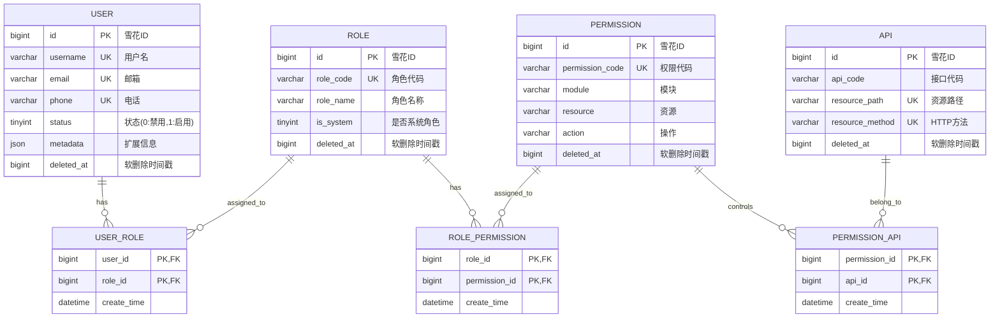

# 数据库设计文档

本项目采用 RBAC (Role-Based Access Control) 模型进行权限管理，主要包含用户、角色、权限、接口四个核心实体。

## 1. 实体关系图 (ER Diagram)

## 2. 表结构说明

### 2.1 核心实体表

#### 用户表 (`user`)
存储用户基础信息。
- **ID策略**：雪花ID (`BIGINT`)
- **认证**：不存储密码，密码由独立的认证服务 (`mimir-auth`) 管理。
- **唯一性**：用户名、邮箱、电话均有唯一索引。
- **NULL处理**：邮箱和电话允许 `NULL`，以兼容 MySQL 唯一索引对 `NULL` 的处理（允许多个 NULL）。
- **软删除**：`deleted_at` 为 `BIGINT` 类型，0 表示未删除，删除时存入时间戳。

#### 角色表 (`role`)
定义系统角色（如管理员、用户、游客）。
- **系统角色**：`is_system` 字段标识系统内置角色，不可删除。
- **角色代码**：如 `ADMIN`, `USER`, `GUEST`，用于业务逻辑判断。

#### 权限表 (`permission`)
定义功能操作权限（动作级）。
- **结构**：扁平结构，不使用树形层级，也不使用权限组。
- **格式**：`module:resource:action` (如 `user:profile:update`)。
- **存储**：模块、资源、操作拆分为独立字段，便于检索。

#### 接口表 (`api`)
定义系统后端 API 接口。
- **匹配**：通过 `resource_path` 和 `resource_method` 唯一标识一个接口。
- **关联**：接口本身不存储权限信息，通过 `permission_api` 关联表与权限绑定。

### 2.2 关联关系表

#### 用户-角色关联 (`user_role`)
- **多对多**：一个用户可拥有多个角色，一个角色可赋予多个用户。
- **主键**：联合主键 `(user_id, role_id)`，移除独立 ID 字段以节省空间。

#### 角色-权限关联 (`role_permission`)
- **多对多**：角色与权限的关联。
- **主键**：联合主键 `(role_id, permission_id)`。

#### 权限-接口关联 (`permission_api`)
- **一对多**：一个权限可以控制多个接口（如"更新用户"权限可能涉及多个 API 及其版本）。
- **主键**：联合主键 `(permission_id, api_id)`。

## 3. 核心设计决策

1.  **雪花ID (Snowflake ID)**
    *   选用 `BIGINT` 类型的雪花 ID 作为主键，而非 UUID 或自增 ID。
    *   **优势**：有序性提高索引性能，分布式唯一，不依赖数据库生成。

2.  **逻辑删除 (Soft Delete)**
    *   使用 `deleted_at` 字段 (`BIGINT`)。
    *   **策略**：`0` 代表未删除，`时间戳` 代表已删除。
    *   **优势**：配合唯一索引使用（例如 `unique(username, deleted_at)` 实际上无法实现，因为 MySQL 唯一索引视 NULL 为不同，视 0 为相同。**修正**：本设计中，如果业务需要"删除后可重用用户名"，应用程序需在查询时过滤 `deleted_at = 0`，且唯一索引无法直接覆盖"删除后重用"的全部场景，通常需要业务逻辑配合或将 `deleted_at` 纳入唯一索引（仅当 `deleted_at` 不为 0 时区分）。*注意：当前设计中唯一索引仅加在业务字段上，这意味着未删除和已删除的记录在业务字段上都不能冲突，若需支持"删除后重名"，需调整唯一索引策略。*)
    *   **当前策略**：核心业务字段（如 `username`）上的唯一索引是全局的。如果删除了一个用户，相同的用户名无法再次创建，除非物理删除或修改索引策略。这符合某些严格审计系统的要求。

3.  **无外键约束**
    *   数据库层面不设置 `FOREIGN KEY`。
    *   **原因**：提高写入性能，避免死锁，便于分库分表和数据迁移。数据完整性由应用层保证。

4.  **JSON 扩展**
    *   核心表均包含 `metadata` (`JSON`) 字段。
    *   **用途**：存储非结构化、临时性或将来可能的扩展数据，避免频繁修改表结构。

5.  **索引优化**
    *   严格控制每个表的索引数量（不超过 5 个）。
    *   优先保证主键和唯一索引，尽量使用联合索引覆盖查询。

## 4. 迁移与初始化

- 数据库迁移使用 Flyway/Liquibase 格式的 SQL 脚本。
- 初始化数据脚本 (`V2__init_roles_data.sql`) 预置了基础角色。

