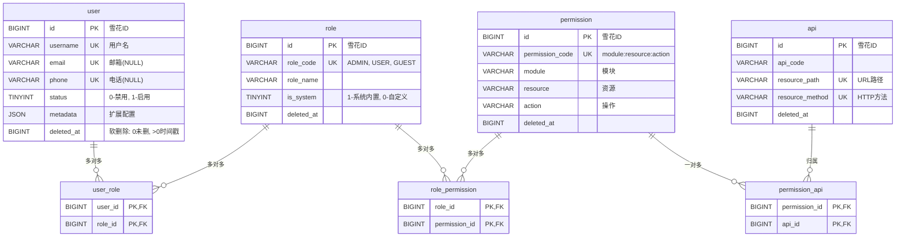

# 用户权限服务数据库设计 (Valhalla User)

本目录包含 **Valhalla User** 服务的数据库表结构设计。该服务专注于用户基础信息管理、角色与权限控制 (RBAC)。

## 核心架构 (ER图)



## 目录结构

```text
db/
├── schema/              # 单表定义 (DDL)
│   └── rbac_schema.sql  # RBAC 核心表结构定义
└── migration/           # 数据库版本迁移脚本 (Flyway)
    ├── V1__init_rbac_schema.sql  # 初始化表结构
    └── V2__init_roles_data.sql   # 初始化基础角色数据
```

## 关键设计规范

### 1. 核心字段策略

*   **主键 (ID)**: 全局统一使用 **雪花算法 (Snowflake ID)** 生成 `BIGINT`。
*   **软删除**: 统一使用 `deleted_at` (`BIGINT`)。
    *   `0`: 未删除
    *   `>0`: 删除时间戳 (Unix Timestamp)
    *   *优势*: 配合应用层逻辑，支持历史数据留存与审计。
*   **扩展性**: 核心表均包含 `metadata` (`JSON`) 字段，用于存储非结构化、临时性或将来可能的扩展数据。

### 2. 状态码与字典

| 字段 | 值域说明 |
| :--- | :--- |
| **status (User)** | `0`-禁用, `1`-启用 (默认) |
| **is_system (Role)** | `0`-自定义角色, `1`-系统内置角色 (不可删除) |
| **role_code** | `ADMIN`-管理员, `USER`-普通用户, `GUEST`-游客 |
| **permission_code** | 格式: `module:resource:action` (如 `user:profile:update`) |
| **resource_method** | `GET`, `POST`, `PUT`, `DELETE`, `PATCH` 等标准 HTTP 方法 |

### 3. 设计原则

*   **认证分离**: 
    *   本服务**不存储密码**。密码、Token、MFA 等敏感认证信息由独立的 `mimir-auth` 服务管理。
    *   仅维护用户的档案信息 (Profile) 和权限关系。
*   **唯一性策略**: 
    *   `username`, `email`, `phone` 字段在数据库层面设有唯一索引。
    *   `email` 和 `phone` 允许为 `NULL`，以兼容 MySQL 唯一索引特性（允许多个 NULL）。
*   **性能优化**:
    *   **无外键**: 数据库层面不设置 `FOREIGN KEY`，避免死锁与性能损耗，数据完整性由应用层保障。
    *   **索引控制**: 单表索引数量严格控制在 5 个以内，平衡读写性能。
    *   **联合主键**: 关联表 (`user_role`, `role_permission`, `permission_api`) 使用联合主键，移除独立 ID，减少存储空间。

## 快速开始

```bash
# 1. 初始化表结构
mysql -u user -p valhalla_user < db/migration/V1__init_rbac_schema.sql

# 2. 初始化基础数据 (默认角色)
mysql -u user -p valhalla_user < db/migration/V2__init_roles_data.sql
```
