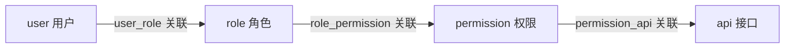

# 业务领域划分

<!--!
  本文件记录项目的业务领域划分，随业务演进持续更新。
  智能体据此判断代码应该放在哪里、新功能属于哪个领域。

  与 ARCHITECTURE.md 的区别：
  - ARCHITECTURE.md = 技术架构（分层、依赖方向、技术栈），相对稳定
  - 本文件 = 业务领域（领域边界、职责、实体），随业务演进变化

  修改本文件不需要架构 RFC，但需要更新 AGENTS.md 中的导航链接。
-->

## 领域清单

| 领域 | 职责说明 | 代码位置 | 关键实体 |
|------|----------|----------|----------|
| user | 用户账号全生命周期管理：创建、更新、禁用/启用、删除、角色分配 | `domain/user/`、`app/user/` | User（聚合根）、UserStatus（值对象） |
| role | 角色定义与权限分配：创建角色、管理角色-权限关联、系统角色保护 | `domain/role/`、`app/role/` | Role |
| permission | 权限定义与接口绑定：模块/资源/操作三级编码、权限-接口关联 | `domain/permission/`、`app/permission/` | Permission |
| api | 系统接口注册与版本管理：接口路径/方法/版本/状态的 CRUD | `domain/api/`、`app/api/` | Api |

## 领域间关系

## 领域通信规则

- 领域之间不允许循环依赖
- user 领域持有 roleIds（角色分配），但不直接操作 Role 实体
- role 领域持有 permissionIds（权限分配），但不直接操作 Permission 实体
- permission 领域持有 apiIds（接口绑定），但不直接操作 Api 实体
- 跨领域查询在 app 层的 ApplicationService 中编排，不在 domain 层跨域调用

## 数据关联模型

| 关联表 | 左侧 | 右侧 | 关系 |
|--------|-------|-------|------|
| `user_role` | user.id | role.id | 多对多 |
| `role_permission` | role.id | permission.id | 多对多 |
| `permission_api` | permission.id | api.id | 一对多 |

## 权限编码规范

权限采用三级编码格式：`{module}:{resource}:{action}`

- **module**：业务模块（如 user、role、system）
- **resource**：资源类型（如 profile、list、config）
- **action**：操作类型（如 create、read、update、delete）

示例：`user:profile:update`、`role:list:read`
