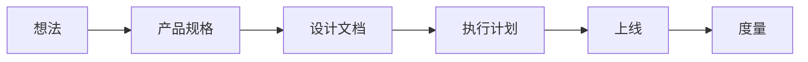

# 产品思维

<!--!
  本文件让智能体理解产品层面的上下文。
  当智能体需要做产品权衡（功能取舍、优先级、用户体验决策）时，
  应参考此文件中的原则和框架，而不是自行猜测。
-->

## 这个产品是给谁用的？

- **直接用户**：平台管理员，通过 valhalla-user-admin 前端管理面板操作用户和权限
- **间接用户**：其他内部微服务（如 valhalla-auth），通过 RPC/REST 调用本服务获取用户和权限数据
- **最终受益者**：Valhalla 平台的所有终端用户，他们的账号和权限由本服务管理

## 产品原则

1. **数据一致性优先于操作便利性** — 宁可让管理员多确认一步，也不允许角色/权限出现不一致状态
2. **接口版本化保护下游** — API 资源支持版本管理和状态流转（ENABLED → DEPRECATED → DISABLED），废弃接口不会突然断裂
3. **权限最小化** — 新用户默认无角色，角色默认无权限，所有授权必须显式分配
4. **可审计** — 所有写操作记录 create_time/update_time，软删除保留历史数据

## 决策优先级

1. 用户安全与数据完整性（绝不妥协）
2. 核心工作流可靠性
3. 功能完整性
4. 打磨与愉悦感

## 功能生命周期

| 阶段 | 文档位置 | 智能体的角色 |
|------|----------|-------------|
| 产品规格 | `docs/active/{需求}/spec.md` | 阅读规格，理解要构建什么 |
| 设计文档 | `docs/active/{需求}/design.md` | 阅读设计，理解技术方案和约束 |
| 执行计划 | `docs/active/{需求}/plan.md` | 按计划执行任务，更新进度 |

## 架构层不进入每功能流转（重要）

**以下文档是"长期架构约束"，不随单个功能迭代修改：**

| 长期约束文档 | 为什么不进流转 |
|---|---|
| `ARCHITECTURE.md` | 系统级边界、分层、依赖方向 |
| `docs/design-docs/core-beliefs.md` | 跨所有决策的工程信条 |
| `docs/SECURITY.md` / `docs/RELIABILITY.md` | 跨功能的长期约束 |

**规则：**
- 智能体在执行产品规格 / 设计文档 / 执行计划时，**只读**上述架构层文档，不修改
- 若发现必须动架构层约束，**暂停当前流转**，走独立的"架构 RFC"（新建一份 `docs/design-docs/arch-{主题}.md` 并升级 core-beliefs / ARCHITECTURE）
- 架构层变更不能作为某次功能实现的副产物悄悄入库
